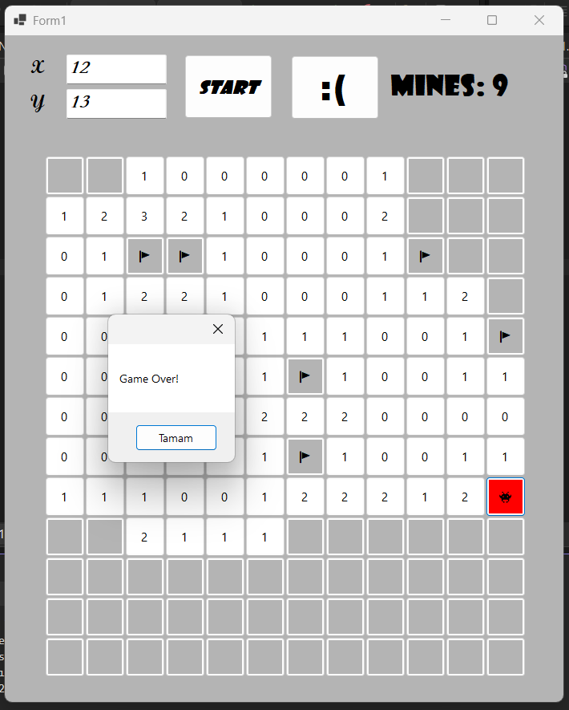

# mineSweeper

A simple Minesweeper game made with **C# and Windows Forms**.

## Features

- Customizable board size
- Randomly generated mines
- Left-click to reveal cells
- Right-click to place and remove flags
- Automatic cell opening when there are no nearby mines
- Mine counter
- Game over detection
- Reset / restart functionality

## How to Play

1. Enter the desired **X (column)** and **Y (row)** values.
2. Click **START** to generate the board.
3. Left-click a cell to reveal it.
4. Right-click a cell to place or remove a flag.
5. Avoid the mines and try to reveal the entire board!

## Technologies

- C#
- .NET
- Windows Forms
- Visual Studio
